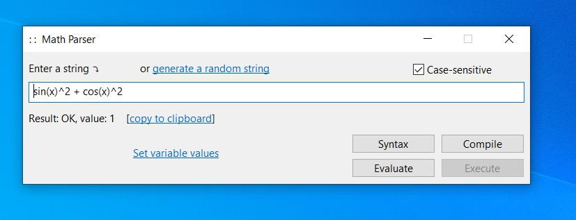

### About the Mparser.exe App

MParser.exe is a Win32 demo app for the MathParser class. It can evaluate math expressions containing common math functions.



To replace the English interface with the Russian one, link with mp_rus(16LE).rc.

### About the MathParser Class

MathParser is a simple parser for math expressions. It, along with some helper classes, is defined in 4 files:

- mp.cpp
- mp.hpp
- mp_mystack.cpp
- mp_mystack.hpp.

MathParser has 3 independent ways to process math expressions:

1. Parse method - syntactically analyses the expression without evaluating it;

2. Evaluate method - evaluates the expression;

3. Compile method - compiles the expression into an internal code for the subsequent quick evaluation by Execute.


(2) and (3) will produce the same result, but (3) could prove more efficient when a single expression has to be evaluated on multiple sets of arguments.

MathParser also serves as a container for expressions and variable identifiers.

### Sample Code

#### 1. Parse

```sh
#include "mp.hpp"
...
MathParser mp{ true }; // the Boolean argument specifies case sensitivity

size_t unused{}, err_pos{};

mp.InsertString(L"sin(x1  x2)^2 + cos(x1 + x2)^2", 0, unused); 
mp.InsertString(L"sin(x1 + x2)^2 + cos(x1 + x2)^2", 1, unused);

auto
err_code = mp.Parse(err_pos, 0);
	// returns err_code == ExpectedBiSignRightPar at err_pos == 8
	// (expected binary sign or right parenthesis)
    
err_code = mp.Parse(err_pos, 1);
	// returns OK
```

#### 2. Evaluate

```sh
#include "mp.hpp"
...
MathParser mp{ true };

size_t unused{}, err_pos{};
const vector<double> args1 = { 1.0, 2.5 }, args2 = { -1.0, -2.5 };
double value{};

mp.InsertString(L"sin(log(x1 + x2))^2 + cos(log(x1 + x2))^2", 0, unused);

auto
err_code = mp.Evaluate(err_pos, args1, value, 0);
	// returns err_code == UnknownIdentifier at err_pos == 8

mp.CheckAndInsertVar(L"x1", 0, unused);
mp.CheckAndInsertVar(L"x2", 1, unused);

err_code = mp.Evaluate(err_pos, args1, value, 0);
	// returns err_code == OK, value == 1.0

err_code = mp.Evaluate(err_pos, args2, value, 0);
	// returns err_code == FloatingPointErrorNaN at err_pos == 4
```

#### 3. Compile + Execute

```sh
#include "mp.hpp"
...
MathParser mp{ true };

size_t unused{}, err_pos{};
const vector<double> args1 = { 1.0, 2.5 }, args2 = { -1.0, -2.5 };
double value{};

mp.InsertString(L"sin(log(x1 + x2))^2 + cos(log(x1 + x2))^2", 0, unused);

auto
err_code = mp.Compile(err_pos, 0);
	// returns err_code == UnknownIdentifier at err_pos == 8

mp.CheckAndInsertVar(L"x1", 0, unused);
mp.CheckAndInsertVar(L"x2", 1, unused);

err_code = mp.Compile(err_pos, 0);
	// returns err_code == OK

err_code = mp.Execute(err_pos, args1, value, 0);
	// returns err_code == OK, value == 1.0

err_code = mp.Execute(err_pos, args2, value, 0);
	// returns err_code == FloatingPointErrorNaN at err_pos == 4
```

NOTE: By design, Parse treats unknown variable identifiers differently from Evaluate/Compile. Parse does not use inputs provided by CheckAndInsertVar, it only checks that an identifier is a valid one (containing letters, digits and underscores and not beginning with a digit). On the other hand, Evaluate/Compile will raise an UnknownIdentifier error when they have reached an identifier not registered with CheckAndInsertVar. Suppose the identifier "x1" has not been registered via CheckAndInsertVar:

```sh
Input string	Method              	Result
--------------------------------------------------------------
"x1"		Parse               	OK
"x1"	    	Evaluate/Compile	UnknownIdentifier
```
More info in mp.hpp.


